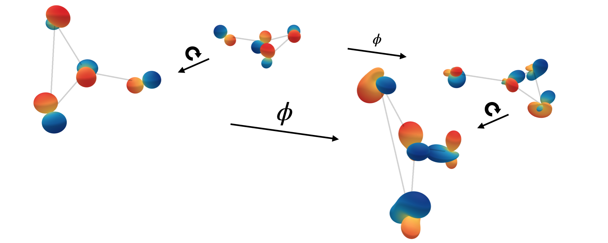
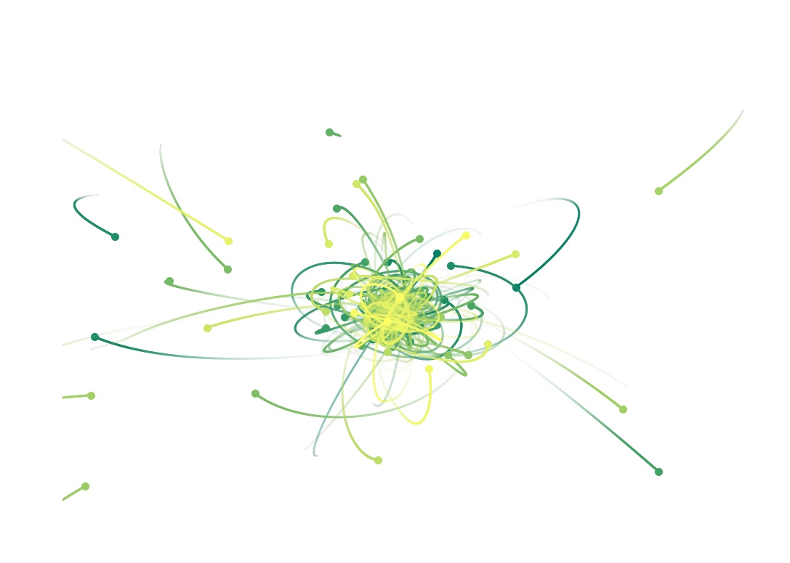

# E(3) Steerable GNN

This repo containst the code and experiments for the paper
[Geometric and Physical Quantities improve E(3) Equivariant Message Passing](https://arxiv.org/abs/2110.02905) by Johannes Brandstetter, Rob Hesselink, Elise van der Pol, Erik Bekkers and Max Welling. 


The codebase was created by Johannes Brandstetter, Rob Hesselink and Erik Bekkers. If you use this code in your work, please cite us:

```bibtex
@article{brandstetter2021geometric,
      title={Geometric and Physical Quantities improve E(3) Equivariant Message Passing},
      author={Johannes Brandstetter and Rob Hesselink and Elise van der Pol and Erik Bekkers and Max Welling},
      year={2021},
      eprint={2110.02905},
      archivePrefix={arXiv},
      primaryClass={cs.LG}
}
```

We have also created an accompanying [blog post](https://robdhess.github.io/Steerable-E3-GNN/).

This blog post contains additional material (Youtube videos, talks, ...) to help you dive further into the subject.

## SEGNN
SEGNN is an E(3) steerable graph neural network. It can incorporate vector or tensor-valued information to send directional information, while remaining equivariant to E(3) transformations. We have tried to make the implementation general, so that you may easily apply SEGNN to your data.




## Dependencies
The repository contains an exported conda environment (```environment.yml```), which you can use to install all dependencies.
Dependencies include:
* Python 
* [PyTorch](https://pytorch.org/) 
* [PyTorch Geometric](https://pytorch-geometric.readthedocs.io/en/latest/)
* [E3NN](https://e3nn.org/) 
* [Weights & Biases](https://wandb.ai/site) 


## Experiments
This code allows for running three experiments mentioned in the paper:
* QM9: regression of 12 molecular properties
* Nbody (charged): Predicting particle trajectories of 5 particles under electrical force
* Nbody (gravity): Predicting particle trajectories of 100 particles under gravitational force

#### Creating N-Body data
To recreate the datasets used in this work, navigate to ```nbody/dataset/``` and run either
```bash
python3 -u generate_dataset.py --simulation=charged --num-train 10000 --seed 43 --suffix small
```
or 
```bash
python3 -u generate_dataset.py --simulation=gravity --num-train 10000 --seed 43 --suffix small
```

#### QM9
To run the QM9 experiments, adapt target, lmax_h, lmax_attr and radius.
```bash
python3 main.py --dataset=qm9 --epochs=1000 --target=alpha --radius=2 --model=segnn --lmax_h=2 --lmax_attr=3 --layers=7 --subspace_type=weightbalanced --norm=instance --batch_size=128 --gpu=1 --weight_decay=1e-8 --pool=avg
```

#### N-Body (charged):
To run the SEGNN, use 
```bash
python3 main.py --dataset=nbody --epochs=1000 --max_samples=3000 --model=segnn --lmax_h=1 --lmax_attr=1 --layers=4 --hidden_features=64 --subspace_type=weightbalanced --norm=none --batch_size=100 --gpu=1 --weight_decay=1e-12 
```

To run the linear SEConv, use
```bash
python3 main.py --dataset=nbody --epochs=1000 --max_samples=3000 --model=seconv --lmax_h=1 --lmax_attr=1 --layers=4 --hidden_features=80 --subspace_type=weightbalanced --conv_type=linear --norm=instance --batch_size=100 --gpu=1 --weight_decay=1e-12 
```

To run the non-linear SEConv, use
```bash
python3 main.py --dataset=nbody --epochs=1000 --max_samples=3000 --model=seconv --lmax_h=1 --lmax_attr=1 --layers=4 --hidden_features=64 --subspace_type=weightbalanced --conv_type=nonlinear --norm=instance --batch_size=100 --gpu=1 --weight_decay=1e-12 
```

#### N-Body (gravity)



To run the SEGNN, use 
```bash
python3 main.py --dataset=gravity --neighbours=6 --epochs=1000 --max_samples=10000 --model=segnn --lmax_h=1 --lmax_attr=1 --layers=4 --hidden_features=64 --subspace_type=weightbalanced --norm=none --batch_size=100 --gpu=1 --weight_decay=1e-12 
```
#### Timing experiments
For QM9, please run the following, using further model specifications. The warmup period allows for the warmup of CUDA kernels. 
```bash
python3 time.py --warmup=50 --forward_passes=1000
```

For the N-Body datasets, please run the previous commands with the flag ```--time_exp=yes```
