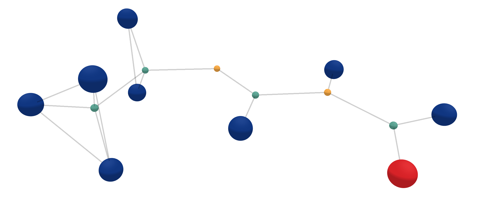
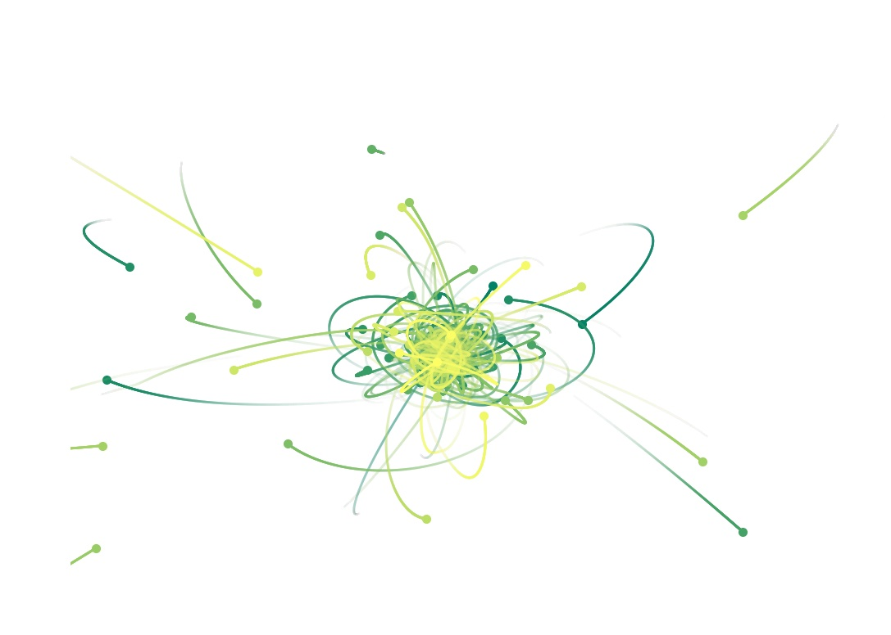

<link rel="stylesheet" href="assets/css/accordion.css">

This is a blog post accompanying the ICLR 2022 spotlight paper [Geometric and Physical Quantities Improve E(3) Equivariant Message Passing
](https://arxiv.org/abs/2110.02905). The goal is to give a quick overview of our method, its motivations and its consequences, maybe in a way that is more accesible than in the paper itself.
We also link several ressources which we find helpful not only for understanding the paper, but also for getting acquainted with equivariant graph networks in general.

# Steerable equivariant message passing

### Motivation: deep learning on graphs

Deep learning methods have found their place in more and more different types of data. Graphs, point clouds, manifolds and groups all have specialised deep learning tools—with quite some success.
For example, there is a lot of work ongoing for predicting molecular properties by treating them as graphs.
In order to do so, atoms are treated as nodes and a cutoff radius defines the edges between them. The larger the cutoff radius, the more connections.

But there are many more things you can do with graph structured data besides atoms. In this work we also put quite some emphasis on dynamical systems, more precisely on charged 5-body systems obeying the laws of electrodynamics, and also on 100-body systems obeying the laws of gravity. An example of the latter is shown here. For such systems it is crucial to predict individual changes of (relative) positions and of forces for given timesteps accordingly. 

The goal of our paper is to design a flexible and easily to adapt message passing approach, which is maximally expressive due to E(3) equivariance. Furthermore, we want different physical and geometric cues to be easy to integrate into the [message passing](https://arxiv.org/abs/1704.01212v1) scheme. Such cues could be forces, velocities or relative positions.   

### Equivariance

As any chemist may tell you, the three-dimensional structure of a molecule is of great importance for predicting its properties. However, we should not overfit on the way the molecule is presented to us. For example, the predicting the energy should be invariant to rotations, reflections and translations. For other tasks, such as predicting the force on each atoms, the predictions should rotate as the molecule is rotated. This is the key to equivariance: as the input is transformed, the output transforms _predictably_. This property allows a model to generalise to all possible rotations, while only ever seeing a molecule in a single pose. As one can imagine, this greatly increases data efficiency as it removes the need for showing the molecule under every angle using data augmentation.

Approaching this idea with another perspective, we can say that an invariant function _removes_ information—the orientation can no longer be reconstructed from the output. Similarly, an equivariant function _preserves_ information, since all geometric information is preserved throughout the network. This implies that even though the output is invariant, it is beneficial to discard geometric information only at the last possible moment and have all preceding functions be equivariant.

{:refdef: style="text-align: center;"}

{: refdef}

<!-- ## Steerable E(3) GNN
This blog is about the steerable E(3) graph neural network (SEGNN). This model generalises existing models, such as the [tensor field fetwork](https://arxiv.org/abs/1802.08219), the [SE(3) transformer](https://arxiv.org/abs/2006.10503) and especially the [E(N)GNN](https://arxiv.org/abs/2102.09844). Instead of using standard Euclidean feature vectors, the SEGNN produces features that are coefficients of steerable functions: _spherical harmonics_. Spherical harmonics are functions that live on the sphere $$S^2$$. -->

# SEGNN builing blocks
Let's take a look at how to build a Steerable E(3) GNN. For a short overview, we need:

* **Steerable feature vectors**, which are equivariant with respect to the transformation group of rotations and reflections.
* The **Clebsch-Gordan tensor product**, the workhorse of our method, analogous to the linear transform in standard MLPs.
* Including **physical and geometric cues** into the Clebsch-Gordan tensor product to build a more powerful message and node update layers.

We'll go over these one by one and try to give an intuitive explanation.

### Steerable vectors
The essence of our approach is to build graph neural networks equivariant to $$O(3)$$, the group of rotations and reflections. Equivariance to this group is easily extended to $$E(3)$$ by working only with relative distances. We are used to applying elements of $$O(3)$$ to three-dimensional Euclidean vectors, like so: $$\mathbf{x} \rightarrow \mathbf{R}\mathbf{x}$$. However, by using representations of $$O(3)$$ called [Wigner-D matrices](https://docs.e3nn.org/en/stable/api/o3/o3_irreps.html), the group can act on any $$2l+1 $$ dimensional vector space $$V_l$$, as long as this vector space consists of coefficients in a spherical harmonic basis. Any such vector will be called steerable and denoted with a tilde. For example, $$\tilde{\mathbf{h}}^{(l)}$$ is a steerable vector of order/type $$l$$.

So what exactly are spherical harmonics? Just like the 1D Fourier basis forms a complete orthonormal basis for 1D functions, the spherical harmonics $$Y^{(l)}_m$$ form an orthonormal basis for $$\mathbb{L}_2(S^2)$$, the space of square integrable functions on the sphere $$S^2$$. Any function on the sphere $$f(\mathbf{n})$$ can thus be represented by a steerable vector when it is expressed in a spherical harmonic basis via:

$$
f(\mathbf{n}) = \sum_{l\geq 0} \sum_{m=-l}^l h_m^{(l)} Y_m^{(l)}(\mathbf{n}) \ .
\label{eq1}\tag{1}
$$

We visualise such functions on $$S^2$$ via glyph-visualizations by stretching and colour-coding a sphere based on the function value $$f(\mathbf{n})$$. The figure below shows such a glyph plot.

{:width="410px" style="float: right"}

$$
~ \\
~ \\
~ \\
~ \\
\left\{ \; \mathbf{n} \, ||f(\mathbf{n})|| \;\;\; \left| \;\;\; \mathbf{n} \in S^2 \right. \; \right\} \;\;\; \Longleftrightarrow \;\;\;
~ \\
~ \\
~ \\
~ \\
$$

The next figure visualises what this looks like for our model specifically. We can embed any vector $$\mathbf{x}$$ in a spherical harmonic basis, here shown up to second order. Whenever the original vector is rotated, the coefficients transform predictably under the Wigner-D matrices.

{:refdef: style="text-align: center;"}
{:width="410px"}
{:width="410px"}
{: refdef}

### Clebsch-Gordan tensor product

As long as our features consist of spherical harmonics, equivariance is guaranteed. But we need to be careful to preserve this property throughout the network, when applying linear transformations and non-linear activation functions. Generally, the feature vectors consist of multiple instances of spherical harmonics of different orders. We could apply linear transformations to each type separately, but ideally the information contained in different types interacts. Fortunately, there exists a linear transform that allows us to do exactly this: the Clebsch-Gordan tensor product.

Let $$\tilde{\mathbf{h}}^{(l)} \in V_l = \mathbb{R}^{2l+1}$$ denote a steerable vector of type $$l$$ and $$h^{(l)}_m$$ its components with $$m=-l,-l+1,\dots,l$$.
Then the $$m$$-th component of the type $$l$$ sub-vector of the output of the tensor product between two steerable vectors of type $$l_1$$ and $$l_2$$ is given by

$$
\begin{align}
(\tilde{\mathbf{h}}^{(l_1)} \otimes_{cg} \tilde{\mathbf{h}}^{(l_2)})^{(l)}_{m} = \sum_{m_1=-l_1}^{l_1} \sum_{m_2=-l_2}^{l_2}  C^{(l,m)}_{(l_1,m_1)(l_2,m_2)} h^{(l_1)}_{m_1} h^{(l_2)}_{m_2} \ ,
\label{eq2}\tag{2}
\end{align}
$$

in which $$C^{(l,m)}_{(l_1,m_1)(l_2,m_2)}$$ are the [Clebsch-Gordan coefficients](https://en.wikipedia.org/wiki/Clebsch%E2%80%93Gordan_coefficients).
The Clebsch-Gordan (CG) tensor product  is a sparse tensor product, as generally many of the $$C^{(l,m)}_{(l_1,m_1)(l_2,m_2)}$$ components are zero. Most notably, $$C^{(l,m)}_{(l_1,m_1)(l_2,m_2)} = 0 $$ whenever $$l < |l_1 − l_2|$$ or $$l > l_1 + l_2$$. The Clebsch-Gordan coefficients carry out a change of basis such that the resulting vector is again steerable.

In fact, most of us are already familiar with some versions of the Clebsch-Gordan tensor product. For example, combining to type-1 features to form a type-0 feature is simply the dot-product. Combining two type-1 features to create another type-1 feature is the cross product.

By interleaving Clebsch-Gordan products and non-linearities, we can create MLPs for steerable feature vectors. However, the use of non-linearities is somewhat restricted. For type-0 features, one can use any pointwise non-linearity. For higher types, however, the pointwise non-linearities do not commute with the wigner-D matrices, hereby breaking equivariance. We therefore use specially designed [gated non-linearities](https://arxiv.org/abs/1807.02547), which map features to scalar values and apply sigmoid gates, somewhat reminiscent of the Swish activation.

<!-- The essence of our approach is to build O(3) equivariant graph neural networks
where O(3) is the group of all rotations and reflections.
We do so by using the concept of steerable vectors.
Steerability of a vector $$\tilde{\mathbf{h}}$$ means that for a certain transformation group with transformation parameters $$g$$, the vector transforms via matrix-vector multiplication $$\mathbf{D}(g)$$. For example, a Euclidean vector in $$\mathbb{R}^3$$ is steerable for rotations and reflections $$g \in \text{O}(3)$$ by multiplying the vector with a rotation matrix, thus $$\mathbf{D}(g) = \mathbf{R}$$. -->

<!-- Like regular MLPs, steerable MLPs are constructed by interleaving linear mappings (matrix-vector multiplications)
with non-linearities. Now however, the linear maps transform between steerable vector spaces, for which we define how they transform under the action of a group.
This then sets an equivariance constraint on the operator that maps between these spaces. By only working with such equivariant operators we can guarantee that the entire learning framework is equivariant. -->

<!-- The figure below shows a vector $$\mathbf{x}$$ embedded into the space which is spanned by the spherical harmonics $$Y^{(l)}_m$$.
Each subspace of the sphercial harmonics transforms via the so-called Wigner D-matrices $$\mathbf{D}^l$$ acting on it separately.
The Wigner D-matrices are the representations of the orthogonal group O(3), the group of rotations and reflections.
In the appendix of our paper, we show that the mapping from vectors into spherical harmonics coefficients is O(3) equivariant, and further that vectors
embedded into the basis spanned by spherical harmonics are steerable by the Wigner D-matrices. -->

### Steerable E(3) Equivariant Graph Neural Networks

Let's see what the SEGNN actually looks like in practice. Consider a graph $$\mathcal{G} =(\mathcal{V},\mathcal{E})$$, with nodes $$v_i \in \mathcal{V}$$ and edges $$e_{ij} \in \mathcal{E}$$.
An SEGNN message passing step looks as follows:

$$
\begin{align}
\text{compute message $\tilde{\textbf{m}}_{ij}$ from node $v_j$ to $v_i$:}\hspace{10mm} & \tilde{\mathbf{m}}_{ij} = \phi_m\left(\tilde{\mathbf{f}}_i, \tilde{\mathbf{f}}_j, \lVert \mathbf{x}_j - \mathbf{x}_i \rVert^2; \tilde{\mathbf{a}}_{ij}\right) \label{eq:segnn1} \ , \\
\text{aggregate messages:}\hspace{10mm} & \tilde{\mathbf{m}}_i = \sum_{j \in \mathcal{N}(i)} \tilde{\mathbf{m}}_{ij} \label{eq:segnn2} \ , \\
\text{update node features at node $v_i$:}\hspace{10mm} & \tilde{\mathbf{f}}'_i = \phi_f\left(\tilde{\mathbf{f}}_i, \tilde{\mathbf{m}}_i; \tilde{\mathbf{a}}_i \right) \ , \label{eq:segnn3}
\end{align}
$$

where $$\mathcal{N}(i)$$ represents the set of neighbours of node $$v_i$$, and $$\phi_m$$ and $$\phi_f$$ are steerable MLPs, created by interleaving Clebsch-Gordan tensor products and non-linearities. So what does this all look like? The following animation shows the forward passes for an actual model trained to predict heat capacity. This model contains multiple spherical harmonics up until second order. We randomly choose one of each order, so we can visualise them. Just know that there's more going on than is shown in this animation!

{:refdef: style="text-align: center;"}

{: refdef}

### Injecting Geometric and Physical Cues

In order to make SEGNNs more expressive, we include geometric and physical information in the edge and node updates.
For that purpose, the edge attributes $$\tilde{\mathbf{a}}_{ij}$$ are obtained via the spherical harmonic embedding of relative positions, in most cases, but possibly also relative force or relative momentum.
The node attributes could e.g. be the average edge embedding of relative positions over neighbours of a node, i.e., 
$$\tilde{\mathbf{a}}_i = \frac{1}{\lvert \mathcal{N}(i)  \rvert} \sum_{j \in \mathcal{N}(i)} \tilde{\mathbf{a}}_{ij}$$, and could additionally include node force, spin or velocities, as we do in the N-body experiment.
The use of steerable node attributes in the steerable node update MLPs allows us to not just integrate geometric cues into the message functions, but also leverage it in the node updates.  
We observe that the more geometric and physical quantities are injected the better SEGNNs perform.

# Material

### Code
If after you've read this, you find yourself hungry for more, please check out our [Github](https://github.com/RobDHess/Steerable-E3-GNN) repository where you can find the SEGNN implementation and apply it to your data. You can find the [vanilla SEGNN model](https://github.com/RobDHess/Steerable-E3-GNN/blob/main/models/segnn/segnn.py) and its [different building blocks](https://github.com/RobDHess/Steerable-E3-GNN/blob/main/models/segnn/o3_building_blocks.py).

### Slides
[ICLR 2022 spotlight poster](https://github.com/RobDHess/Steerable-E3-GNN/blob/main/assets/SEGNN_poster.png)

[Accompanying slides](https://github.com/RobDHess/Steerable-E3-GNN/blob/main/assets/SEGNN_slides.pdf)

### Videos
Johannes and Erik were invited to present the paper in the GraphML reading group: \\
[Youtube video of GraphML reading group, March 15 2022](https://www.youtube.com/watch?v=jKXMgaC1oHE).

Have a look at [Erik's Youtube playlist on Group Equivariant Deep Learning](https://www.youtube.com/playlist?list=PL8FnQMH2k7jzPrxqdYufoiYVHim8PyZWd):
Especially:

- [Lecture 3.5 on non-linear steerable graph NNs](https://www.youtube.com/watch?v=CIoXyqDfeok)

- [Lecture 3.6 on non-linear regular graph/group CNNs](https://www.youtube.com/watch?v=PbLRvOri_KM)

# Credit

Our implementation of Steerable E(3) Equivariant Graph Neural Networks (SEGNNs) is built on the excellent [e3nn](https://e3nn.org/) software library of Mario Geiger et al., which allows us to implement all the building that blocks in our paper.

# Correspondence
If you have questions about our paper or the blog, please contact brandstetter[at]ml.jku.at.
